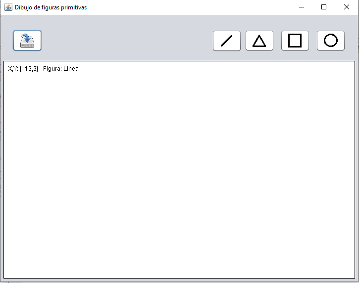
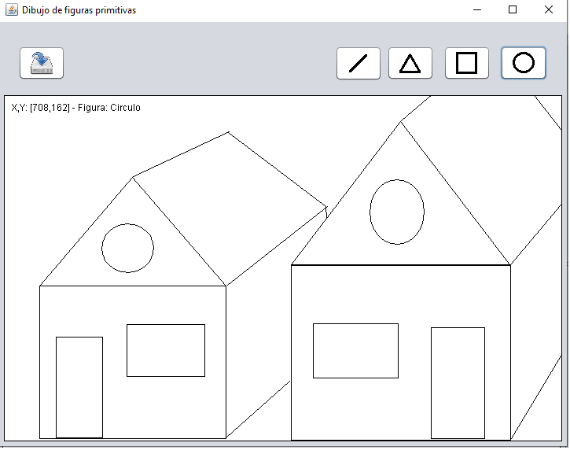

# Figuras Primitivas

Proyecto realizado en Java para el aprendizaje de programación orientado a objetos. Dibujar cada primitiva que se seleccione, y guardar sus coordenadas mediante Listas enlazadas.

